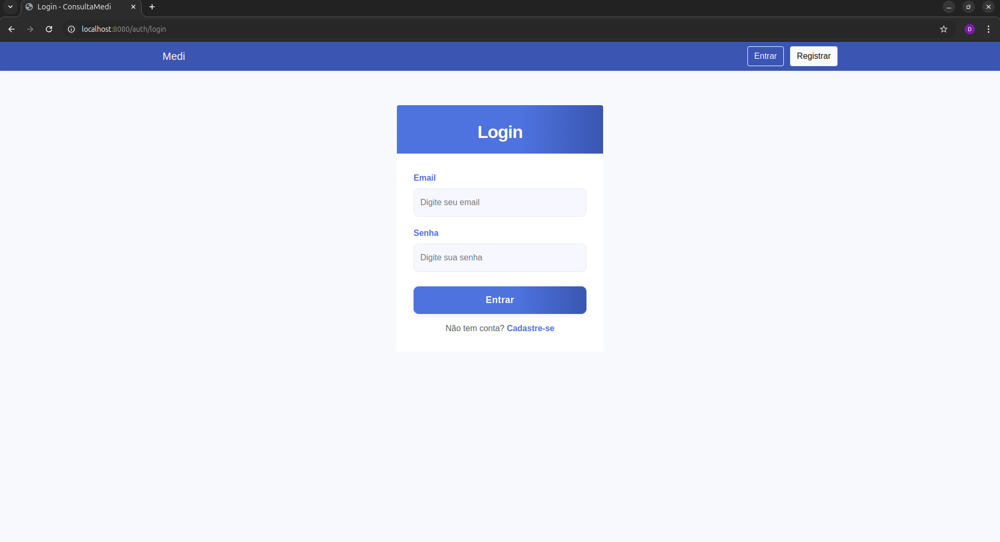
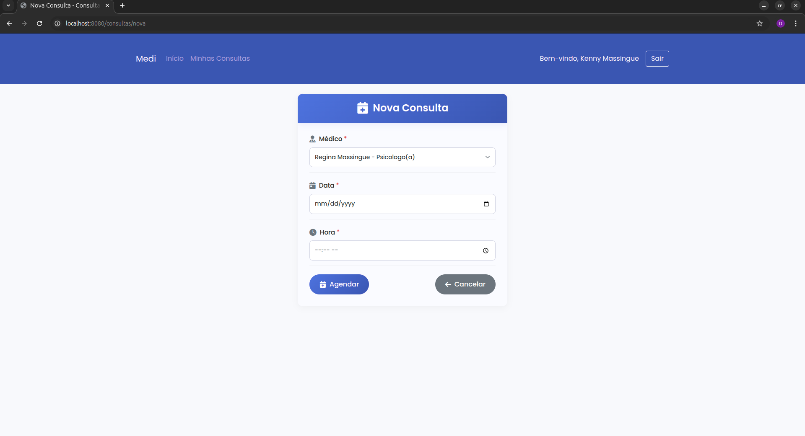
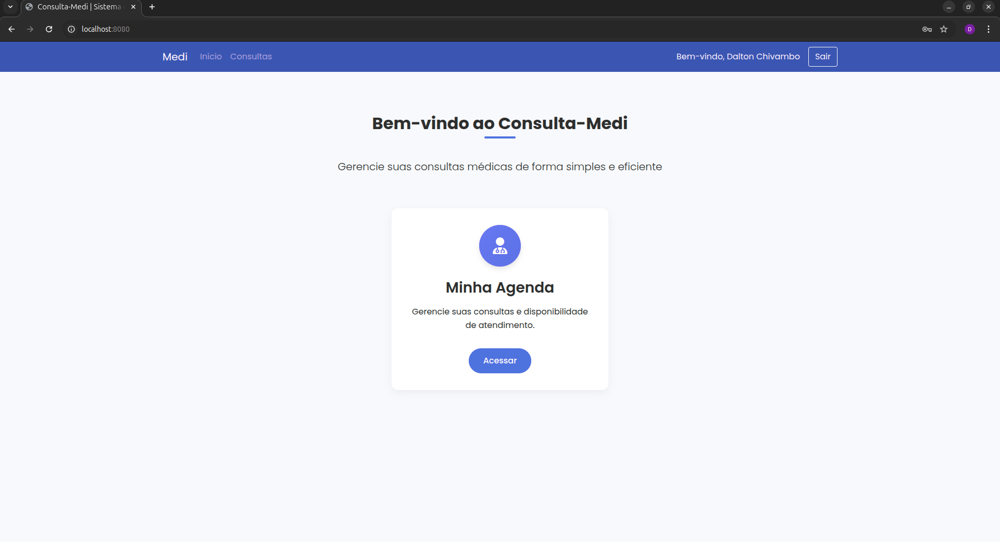
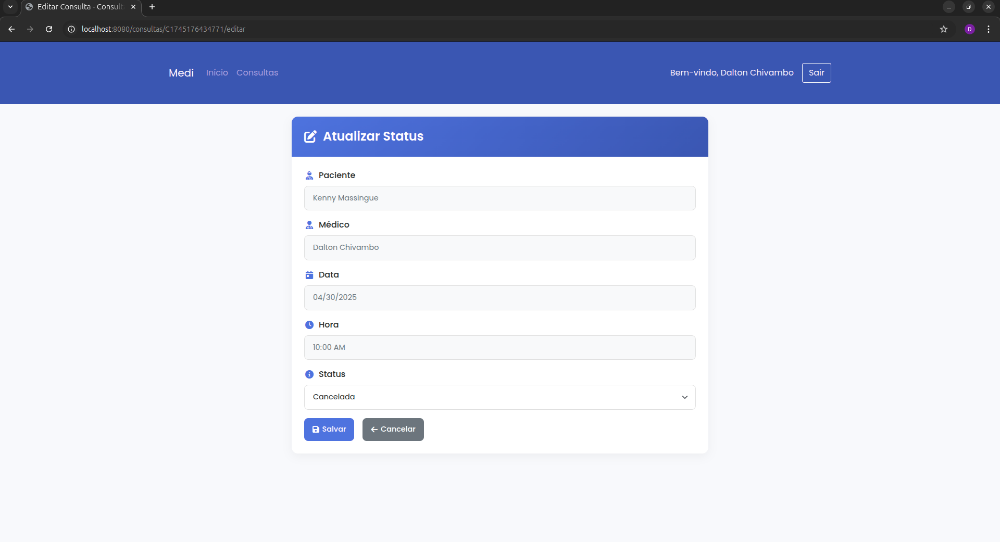
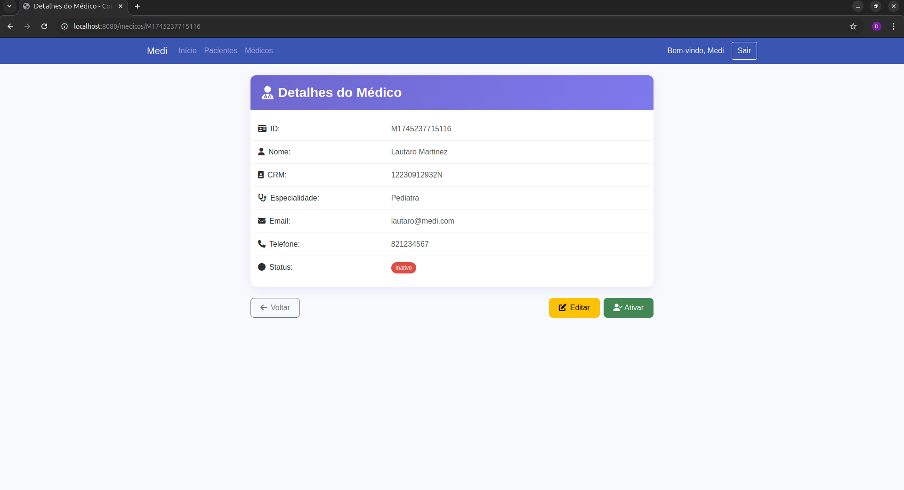
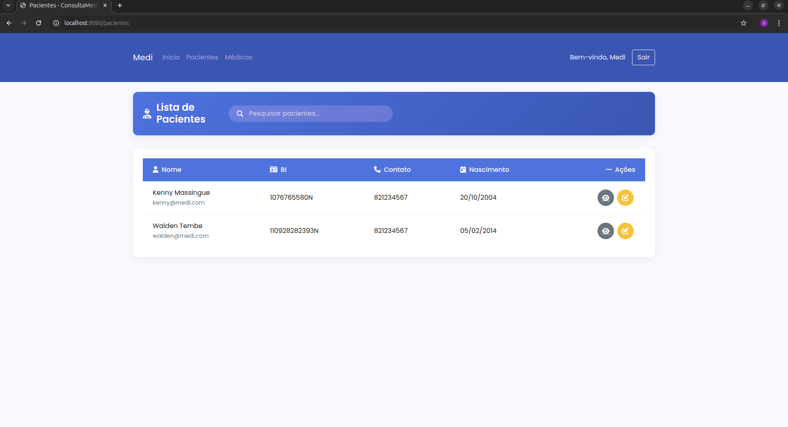
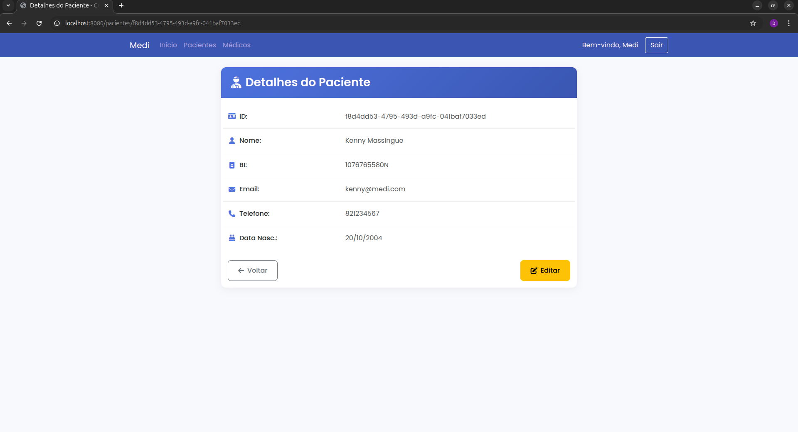

# Apresentação da Aplicação de Consultas Médicas

Este documento apresenta as principais telas da aplicação de consultas médicas, mostrando o fluxo de uso para os diferentes tipos de usuários: pacientes, médicos e administradores.

## Índice

1. [Tela Inicial](#tela-inicial)
2. [Autenticação](#autenticação)
3. [Área do Paciente](#área-do-paciente)
4. [Área do Médico](#área-do-médico)
5. [Área do Administrador](#área-do-administrador)

## Tela Inicial

A tela inicial apresenta a página principal da aplicação, com informações sobre o sistema de consultas médicas.

## Autenticação

### Login

A tela de login permite que os usuários acessem o sistema com suas credenciais.

### Cadastro

A tela de cadastro permite que novos usuários se registrem no sistema.

## Área do Paciente

### Tela Inicial do Paciente

Após o login, o paciente é direcionado para sua área personalizada.

### Minhas Consultas

O paciente pode visualizar todas as suas consultas agendadas.

### Agendamento de Nova Consulta

O paciente pode agendar uma nova consulta médica.

### Detalhes da Consulta

O paciente pode visualizar os detalhes de uma consulta específica.

## Área do Médico

### Tela Inicial do Médico

Após o login, o médico é direcionado para sua área personalizada.

### Consultas do Médico

O médico pode visualizar todas as consultas agendadas para ele.

### Alteração de Status da Consulta

O médico pode alterar o status de uma consulta (confirmada, realizada, cancelada, etc.).

## Área do Administrador

### Tela Inicial do Administrador

Após o login, o administrador é direcionado para sua área de gerenciamento.

### Gerenciamento de Médicos

O administrador pode visualizar e gerenciar todos os médicos cadastrados no sistema.

### Cadastro de Médico

O administrador pode cadastrar novos médicos no sistema.

### Detalhes do Médico

O administrador pode visualizar os detalhes de um médico específico.

### Gerenciamento de Pacientes

O administrador pode visualizar e gerenciar todos os pacientes cadastrados no sistema.

### Cadastro/Edição de Paciente

O administrador pode cadastrar ou editar informações de pacientes.

### Detalhes do Paciente

O administrador pode visualizar os detalhes de um paciente específico.

## Fluxo de Uso da Aplicação

### Fluxo do Paciente

1. Acessa a tela inicial
2. Faz login ou cadastro
3. Visualiza suas consultas
4. Agenda novas consultas
5. Acompanha o status das consultas

### Fluxo do Médico

1. Acessa a tela inicial
2. Faz login
3. Visualiza suas consultas agendadas
4. Atualiza o status das consultas

### Fluxo do Administrador

1. Acessa a tela inicial
2. Faz login
3. Gerencia médicos (cadastro, edição, visualização)
4. Gerencia pacientes (cadastro, edição, visualização)
5. Monitora o sistema como um todo

## Tecnologias Utilizadas

- **Frontend**: HTML, CSS, JavaScript
- **Backend**: Spring Boot
- **Comunicação Distribuída**: CORBA
- **Banco de Dados**: MongoDB
- **Autenticação**: Spring Security

## Conclusão

A aplicação de consultas médicas oferece uma interface intuitiva e funcional para pacientes, médicos e administradores, facilitando o agendamento e gerenciamento de consultas médicas de forma eficiente e segura. 
