# 🏥 Sistema de Consultas Médicas

Sistema de gerenciamento de consultas médicas utilizando Java, Spring Boot, MongoDB e CORBA, Java 8. Esta aplicação permite agendar, cancelar e visualizar consultas de forma eficiente por meio de uma interface web.

---

## 📋 Requisitos

- **Java** 8 (com suporte nativo a CORBA)  
- **Maven** 3.6 ou superior  
- **MongoDB** instalado e rodando (`localhost:27017`)  
- **Terminal** ou console para execução dos comandos  

---

## 🗂 Estrutura do Projeto

```
consulta-medi/
├── ConsultaApp                # Arquivos gerados pelo idl
├── database                   # Arquivos do Banco de Dados
├── lib                        # lib corba.jar
├── orb.db
├── src/
│   ├── main/
│   │   ├── java/com/example/  # Código fonte (server, controller, model, etc.)
│   │   ├── resources/
│   │   │   ├── application.properties
│   │   │   └── templates/     # HTMLs com Thymeleaf
├── target/                    # Build da aplicação
│   └── consulta-medica-1.0-SNAPSHOT.jar
├── ConsultaMedica.idl         # Interface CORBA
├── pom.xml                    # Configurações do Maven
├── README.md                  # Documentação do projeto

```

---

## ⚙️ Configuração e Execução

### 1. Suba o MongoDB

Certifique-se de que o MongoDB está em execução no host padrão:

```bash
sudo systemctl start mongod
```

---

### 2. Importe os Dados para o MongoDB

Os arquivos JSON na pasta `database/consulta_medica/` contêm dados pré-configurados do banco de dados `consulta_medica`. Esses arquivos permitem que qualquer pessoa iniciando o projeto popule rapidamente o banco de dados MongoDB com dados de exemplo. Para importar os dados, utilize o comando `mongoimport`:

```bash
mongoimport --db consulta_medica --collection consultas --file database/consulta_medica/consulta_medica.consultas.json --jsonArray
mongoimport --db consulta_medica --collection medicos --file database/consulta_medica/consulta_medica.medicos.json --jsonArray
mongoimport --db consulta_medica --collection pacientes --file database/consulta_medica/consulta_medica.pacientes.json --jsonArray
mongoimport --db consulta_medica --collection usuarios --file database/consulta_medica/consulta_medica.usuarios.json --jsonArray
```

> **Nota**: Certifique-se de que o MongoDB está rodando antes de executar os comandos. Os comandos acima criam o banco de dados `consulta_medica` e as coleções correspondentes (`consultas`, `medicos`, `pacientes`, `usuarios`) automaticamente.
> **Ou pode usar o mongoDB Compass para importar os arquivos Json.


### 3. Compile os Arquivos IDL (CORBA)

Utilize o compilador `idlj` do Java 8 para gerar os arquivos Java a partir do IDL:

```bash
idlj -fall ConsultaMedica.idl
```

Isso criará os seguintes arquivos:

- `ConsultaMedica.java`: Interface CORBA principal.
- `ConsultaMedicaHelper.java`: Classe auxiliar para manipulação da interface.
- `ConsultaMedicaHolder.java`: Wrapper para passagem por referência.
- `_ConsultaMedicaStub.java`: Cliente stub que realiza as chamadas remotas.
- `ConsultaMedicaOperations.java`: Classe base que tem as operacoes.
- `ConsultaMedicaOperations.java`: Classe base que tem as operacoes.
- `ConsultaMedicaPOA.java`:
- ... entre outras

> Mova os arquivos gerados para `src/main/java/ConsultaApp`
compile usando:
```bash
javac -d target/classes src/main/java/ConsultaApp/*.java
```


### 4. Inicie o Serviço de Nomes CORBA (orbd)

```bash
orbd -ORBInitialPort 1050 &
```

---

### 5. Compile o Projeto

```bash
mvn clean install
```

---

### 6. Inicie o Servidor CORBA

```bash
java -cp target/classes com.example.server.ConsultaMedicaServer -ORBInitialPort 1050 &
```

Você verá a mensagem:

```
Servidor ConsultaMedica pronto e aguardando requisições...
```

---

### 7. Inicie a Aplicação Web (Spring Boot)

```bash
mvn spring-boot:run
```

Acesse: [http://localhost:8080](http://localhost:8080)
ou (http://ip_do_seu_dispositivo_na_rede:8080)

---

## ✅ Funcionalidades

- 📅 Agendamento de Consultas
    - Usuários podem selecionar médicos e horários para marcar consultas.

- ❌ Cancelamento de consultas  
    - Permite ao paciente ou medicos cancelar consultas agendadas.

- 🔄 Atualização de status  
    - O médico pode atualizar o status (Concluida, Cancelada, etc.).

- 🔍 Visualização por paciente  
    - O paciente visualiza suas consultas agendadas e seu histórico.

- 👨‍⚕️ Visualização por médico  
    - Médicos acessam sua agenda de atendimentos

- 👥 Gerenciamento de médicos e pacientes
    - Inclusão, edição, exclusão e visualização de dados.

- 🚫 Bloqueio de Médicos
    - Médicos podem ser bloqueados - inibidos de acessar o sistema


---

## 🧱 Arquitetura

- **Frontend**: Thymeleaf + HTML  
- **Backend**: Spring Boot (Java)  
- **Banco de Dados**: MongoDB  
- **Comunicação**: CORBA puro (Java 8)  

---

## 📦 Dependências

- Spring Boot 2.7.0  
- Spring Data MongoDB  
- Thymeleaf  
- Lombok  

---

# 🧪 Ambiente Testado

Este sistema foi testado e validado com sucesso em:

- ✅ **Ubuntu 24.04 LTS**
- ✅ **Java 8 com JacORB**
- ✅ **MongoDB 7.x**

---

## 🌐 API REST (Principais Endpoints)

> Base URL: `http://localhost:8080/api`

| Método | Endpoint | Descrição |
|--------|----------|-----------|
| GET    | `/consultas` | Lista todas as consultas |
| GET    | `/consultas/{id}` | Consulta específica por ID |
| POST   | `/consultas` | Agendamento de nova consulta |
| DELETE | `/consultas/{id}` | Cancela uma consulta |

Outros endpoints podem ser explorados com ferramentas como Postman ou Swagger (se habilitado).

---

## 🛠 Solução de Problemas

### ❗ Falha ao atualizar consulta

Verifique:
1. Se o serviço **orbd** está ativo:  
   `ps aux | grep orbd`
2. Se o servidor CORBA foi iniciado:  
   `ps aux | grep ConsultaMedicaServer`
3. Reinicie os serviços na ordem: orbd → servidor → aplicação

---


### ❗ Erro de conexão com MongoDB

Confirme:
- Se o MongoDB está rodando  
- Se a URL está correta no `application.properties`:  
  ```
  spring.data.mongodb.uri=mongodb://localhost:27017/consulta_db
  ```

---

## 🤝 Contribuição

1. Fork o projeto  
2. Crie uma branch: `feature/sua-feature`  
3. Commit e push das alterações  
4. Abra um Pull Request  

---

## 📄 Licença

Distribuído sob a licença MIT. Veja o arquivo `LICENSE` para mais detalhes.


# Apresentação da Aplicação de Consultas Médicas

Este documento apresenta as principais telas da aplicação de consultas médicas, mostrando o fluxo de uso para os diferentes tipos de usuários: pacientes, médicos e administradores.

## Índice

1. [Tela Inicial](#tela-inicial)
2. [Autenticação](#autenticação)
3. [Área do Paciente](#área-do-paciente)
4. [Área do Médico](#área-do-médico)
5. [Área do Administrador](#área-do-administrador)

## Tela Inicial

A tela inicial apresenta a página principal da aplicação, com informações sobre o sistema de consultas médicas.

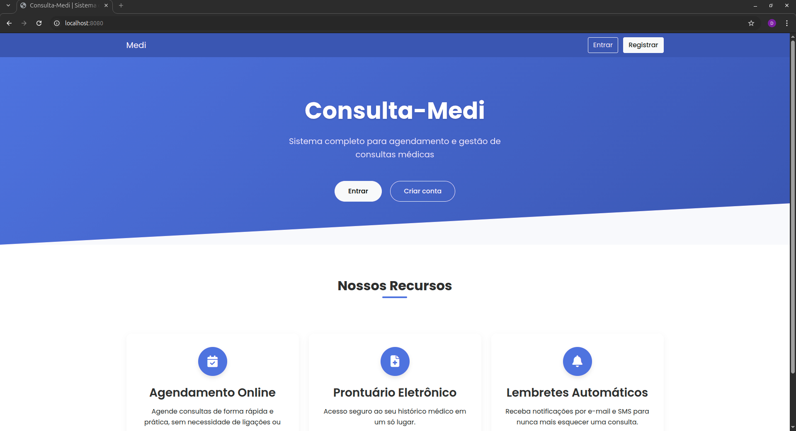

## Autenticação

### Login

A tela de login permite que os usuários acessem o sistema com suas credenciais.

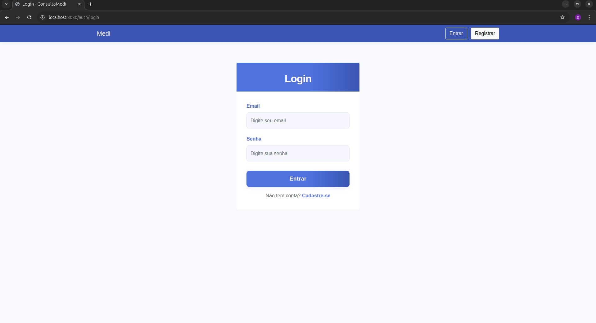

### Cadastro

A tela de cadastro permite que novos usuários se registrem no sistema.

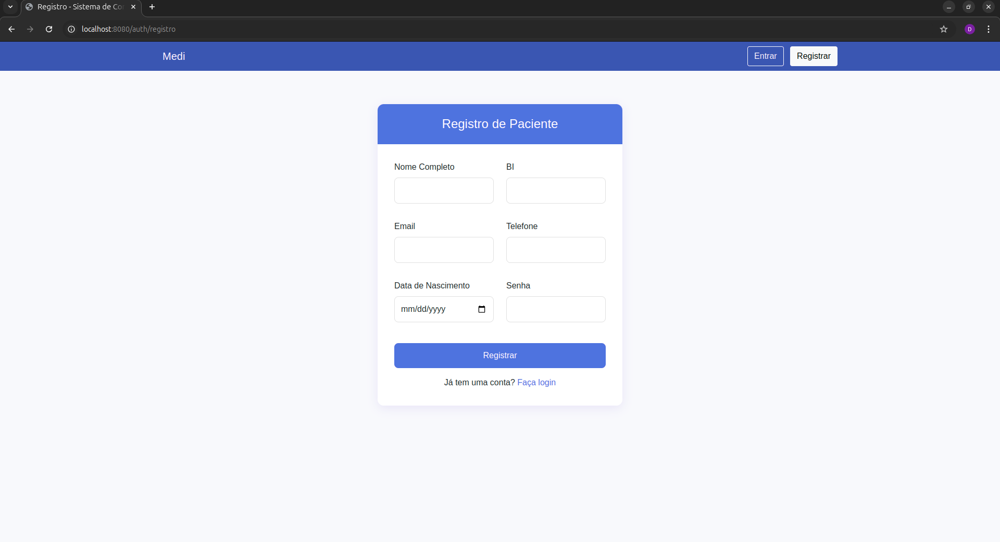

## Área do Paciente

### Tela Inicial do Paciente

Após o login, o paciente é direcionado para sua área personalizada.

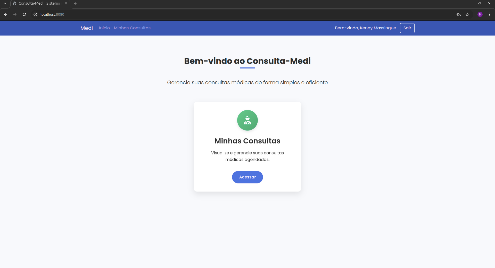

### Minhas Consultas

O paciente pode visualizar todas as suas consultas agendadas.

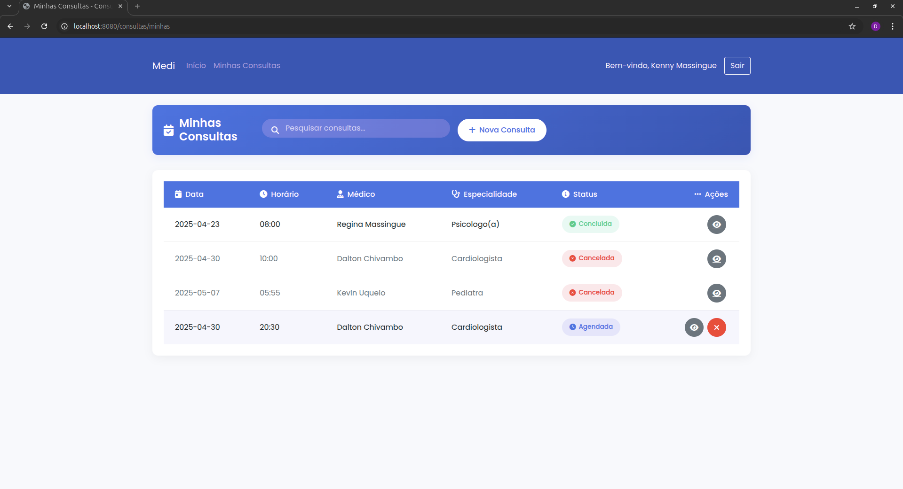

### Agendamento de Nova Consulta

O paciente pode agendar uma nova consulta médica.


### Detalhes da Consulta

O paciente pode visualizar os detalhes de uma consulta específica.

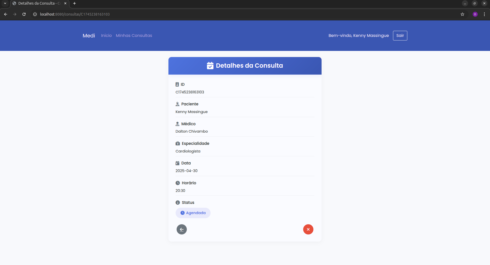

## Área do Médico

### Tela Inicial do Médico

Após o login, o médico é direcionado para sua área personalizada.


### Consultas do Médico

O médico pode visualizar todas as consultas agendadas para ele.

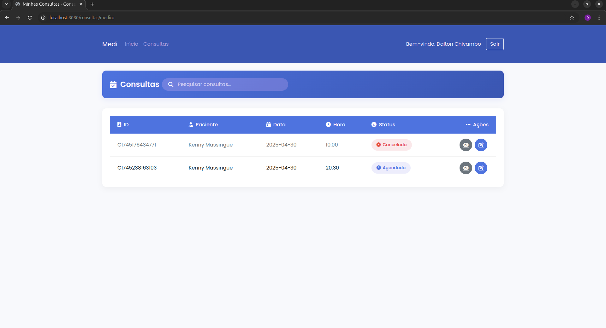

### Alteração de Status da Consulta

O médico pode alterar o status de uma consulta (confirmada, realizada, cancelada, etc.).

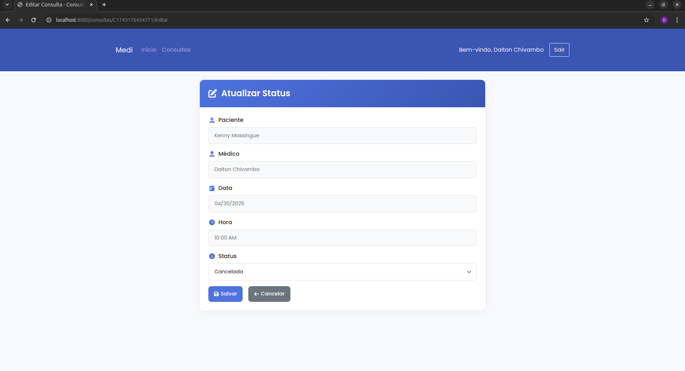

## Área do Administrador

### Tela Inicial do Administrador

Após o login, o administrador é direcionado para sua área de gerenciamento.

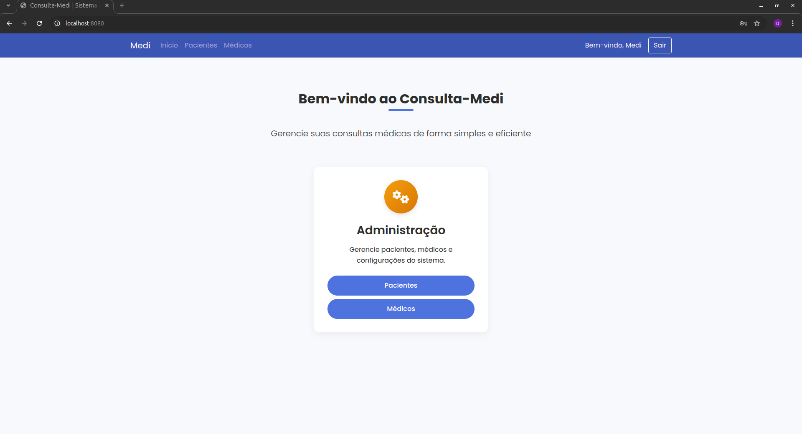

### Gerenciamento de Médicos

O administrador pode visualizar e gerenciar todos os médicos cadastrados no sistema.

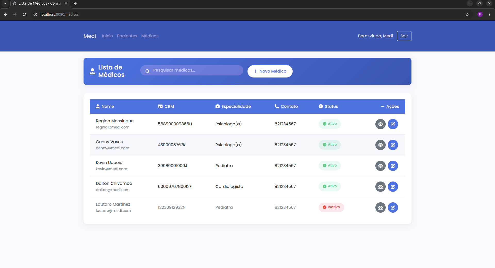

### Cadastro de Médico

O administrador pode cadastrar novos médicos no sistema.

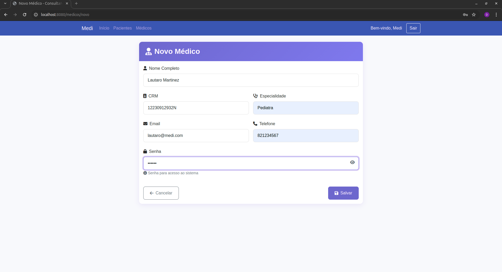

### Detalhes do Médico

O administrador pode visualizar os detalhes de um médico específico.

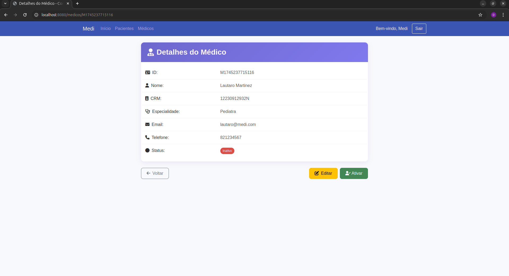

### Gerenciamento de Pacientes

O administrador pode visualizar e gerenciar todos os pacientes cadastrados no sistema.

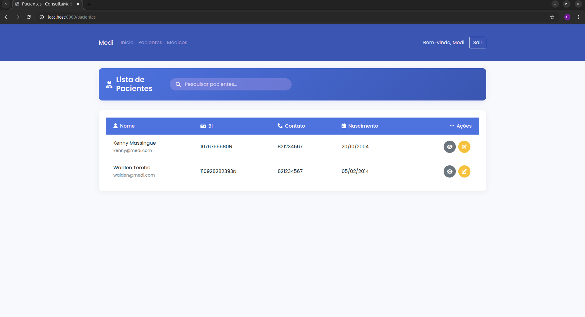

### Cadastro/Edição de Paciente

O administrador pode cadastrar ou editar informações de pacientes.

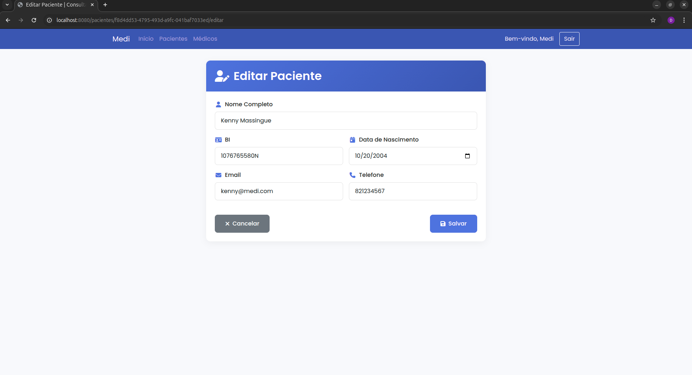

### Detalhes do Paciente

O administrador pode visualizar os detalhes de um paciente específico.

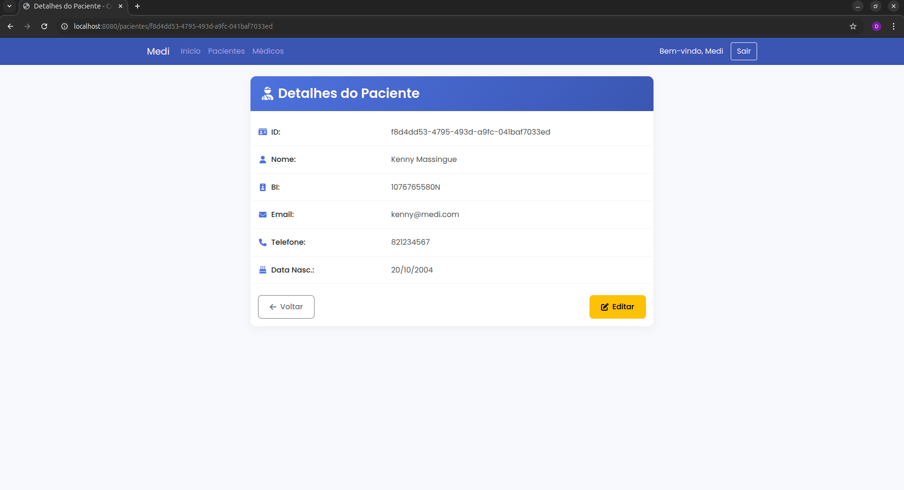

## Fluxo de Uso da Aplicação

### Fluxo do Paciente

1. Acessa a tela inicial
2. Faz login ou cadastro
3. Visualiza suas consultas
4. Agenda novas consultas
5. Acompanha o status das consultas

### Fluxo do Médico

1. Acessa a tela inicial
2. Faz login
3. Visualiza suas consultas agendadas
4. Atualiza o status das consultas

### Fluxo do Administrador

1. Acessa a tela inicial
2. Faz login
3. Gerencia médicos (cadastro, edição, visualização)
4. Gerencia pacientes (cadastro, edição, visualização)
5. Monitora o sistema como um todo

## Tecnologias Utilizadas

- **Frontend**: HTML, CSS, JavaScript
- **Backend**: Spring Boot
- **Comunicação Distribuída**: CORBA
- **Banco de Dados**: MongoDB
- **Autenticação**: Spring Security


